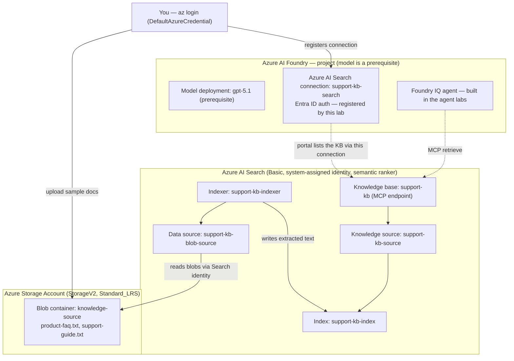

# Knowledge Base — Architecture

This lab builds the `support-kb` knowledge base end to end: a storage account holding the source documents, an Azure AI Search service that indexes them, and the Foundry IQ knowledge source and knowledge base that expose those documents to agents over an MCP endpoint.

## Resources deployed by this lab

| Resource | Detail |
|---|---|
| Storage Account | StorageV2, Standard_LRS; container `knowledge-source` holding the two sample documents |
| Azure AI Search | Basic tier, system-assigned managed identity, semantic ranker enabled |
| Search index | `support-kb-index` — `id`, `content`, and storage metadata fields plus a semantic configuration |
| Data source connection | `support-kb-blob-source` — points at the blob container using the Search managed identity (no keys) |
| Indexer | `support-kb-indexer` — reads blobs, extracts text, writes documents into the index |
| Knowledge source | `support-kb-source` — wraps the index for agentic retrieval |
| Knowledge base | `support-kb` — ties the knowledge source together and exposes the MCP endpoint agents call |
| Project connection | `support-kb-search` — Azure AI Search (`CognitiveSearch`) connection with Entra ID auth; makes the knowledge base visible in the portal's Knowledge (Foundry IQ) blade |

**Prerequisite (not deployed here):** an Azure AI Foundry hub and project with a deployed model (`gpt-5.1`). The agent that consumes this knowledge base is built in the agent labs.

## Identity grants (RBAC)

| Principal | Role | Scope | Why |
|---|---|---|---|
| Search managed identity | Storage Blob Data Reader | Storage account | Indexer reads documents from the container |
| You | Storage Blob Data Contributor | Storage account | Upload the sample documents |
| You | Search Index Data Contributor | Search service | Create the index, data source, indexer, knowledge source, and knowledge base — and back the Entra ID connection the portal uses to list the knowledge base |
| You | Search Service Contributor | Search service | Manage the search service resources |

The Entra ID project connection adds no new role assignments: the portal enumerates the knowledge base with your signed-in identity, which already holds the two Search roles above.

## Data flow

1. You upload the sample documents to the `knowledge-source` blob container.
2. The indexer reads those blobs through the data source connection, authenticating with the Search service's managed identity.
3. The indexer extracts text and writes it into `support-kb-index`.
4. The knowledge source wraps the index, and the knowledge base ties it together and publishes the MCP endpoint.
5. You register the `support-kb-search` Azure AI Search connection on the project so the knowledge base shows up in the portal's Knowledge (Foundry IQ) blade.
6. A Foundry IQ agent (built in the agent labs) calls that MCP endpoint to retrieve grounded answers.
